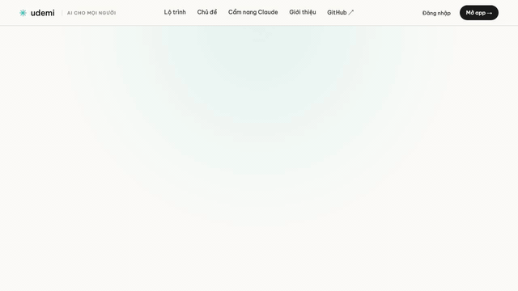

# AI cho mọi người

[](https://udemi.tech)
[](LICENSE)
[](#content)
[](#learning-paths)

> **Học AI và học máy bằng tiếng Việt qua hình ảnh tương tác và ví dụ thực tế.**
> An open-source Vietnamese-language educational platform for AI/ML — built around interactive visualizations, not walls of text.

**[→ Xem app trực tiếp tại udemi.tech](https://udemi.tech)**

---

## Live demo

<p align="center">
  <a href="https://udemi.tech/demo.mp4">
    
  </a>
</p>

<p align="center">
  <em>
    30 giây · 8 cảnh · render bằng <a href="https://www.remotion.dev/">Remotion 4</a> với cùng bảng màu, typography và diacritics tiếng Việt như app.
    <br />
    Bấm vào GIF để xem bản <strong>MP4 độ nét cao</strong> (<a href="https://udemi.tech/demo.mp4">udemi.tech/demo.mp4</a>, 5.5 MB) — tiện cho LinkedIn / X / Twitter.
  </em>
</p>

---

## TL;DR

- **260+ chủ đề AI/ML** trải khắp bốn lộ trình học: Học sinh · Sinh viên, Nhân viên văn phòng, AI Engineer, AI Researcher.
- Mỗi chủ đề được viết lại cho người dùng Việt — ẩn dụ đời thường, ví dụ Việt Nam (Shopee, Techcombank, VinBrain, MoMo…), diacritics chuẩn.
- Bài học **tương tác** bằng slider, drag-drop, toggle-compare, match-pairs, SVG tương tác, animated counter. Text chỉ là phần phụ.
- Stack hiện đại: **Next.js 16 + Turbopack**, React 19, Supabase (auth + progress), Tailwind v4, framer-motion.
- Hosted trên **Vercel** với **Speed Insights + Analytics**.
- Demo video ngay trong repo được build bằng **Remotion 4** — đi theo đúng design system của app.

---

## Features

- **260+ chủ đề** trải từ nền tảng ML đến xu hướng 2026 (reasoning models, RAG, agentic, MoE, diffusion, alignment, long-context…)
- **Bốn lộ trình có hướng dẫn** (`/paths/*`) — mỗi lộ trình tự ghép thứ tự bài trước/sau, có mục tiêu và thời lượng rõ ràng
- **Ưu tiên trực quan** — slider, drag-drop, toggle compare, match pairs, sort challenge, fill blank, custom SVG, framer-motion
- **Tìm kiếm mờ (fuzzy search)** song ngữ Việt–Anh qua Fuse.js
- **Bookmark + tiến độ đọc** lưu cá nhân qua Supabase (anonymous auth)
- **Hướng dẫn Claude** tại `/claude` — guide chuyên sâu cho Claude Code & Claude.ai
- **Ứng dụng thực tế** cho mọi khái niệm (ChatGPT, Claude, Gemini, Copilot, Jasper, Notion AI, o1, v.v.)
- **Responsive** trên mobile/tablet/desktop, tôn trọng `prefers-reduced-motion`
- **Accessibility**: skip-link, reading progress bar, keyboard-first command palette, scroll-reveal bỏ qua khi reduced motion

### Content

- 260+ topic modules in `src/topics/*.tsx` — each a standalone `"use client"` component with its own `metadata`.
- 47 interactive primitives in `src/components/interactive/` — `SliderGroup`, `ToggleCompare`, `DragDrop`, `MatchPairs`, `PredictionGate`, `AhaMoment`, `InlineChallenge`, `QuizSection`, etc.
- 7 `Application*` components in `src/components/application/` that host the "real-world case study" lessons.

### Learning paths

All four paths live under `src/lib/paths.ts` and their entry pages under `src/app/paths/*/page.tsx`.

| Lộ trình | Trọng tâm | Thời lượng ước tính |
| --- | --- | --- |
| **Học sinh · Sinh viên** | Toán nền tảng, ML cơ bản, mạng nơ-ron, kỹ năng thực hành | ~52 giờ |
| **Nhân viên văn phòng** | Prompt, ứng dụng thực tế, an toàn & đạo đức, ứng dụng ngành | ~24 giờ |
| **AI Engineer** | Kiến trúc, LLM & NLP, fine-tuning, RAG & agents, MLOps, đánh giá, an toàn | ~110 giờ |
| **AI Researcher** | Lý thuyết sâu, kiến trúc tiên tiến, NLP & multimodal, alignment, RL, xu hướng mới | ~92 giờ |

Lộ trình Office đã được viết lại riêng cho người không lập trình: không code, không công thức toán, 50–70% JSX là hình ảnh tương tác.

---

## Tech stack

| Layer | Technology |
| --- | --- |
| Framework | [Next.js 16](https://nextjs.org/) (App Router, Turbopack) |
| Runtime | React 19 + TypeScript 5 |
| Styling | [Tailwind v4](https://tailwindcss.com/) + CSS variables (Perplexity × Momo design tokens) |
| Animation | [Framer Motion 12](https://www.framer.com/motion/) |
| Search | [Fuse.js 7](https://www.fusejs.io/) |
| Math rendering | [KaTeX](https://katex.org/) (student/researcher paths only) |
| Backend & Auth | [Supabase](https://supabase.com/) (anonymous auth + `user_progress` table + RLS) |
| Hosting | [Vercel](https://vercel.com/) — Fluid Compute + Speed Insights + Analytics |
| Demo video | [Remotion 4](https://www.remotion.dev/) (`remotion/` folder) |
| Testing | [Vitest](https://vitest.dev/) + Testing Library |

---

## Getting started

### Prerequisites

- [Node.js 20+](https://nodejs.org/)
- [pnpm 10+](https://pnpm.io/)
- Free [Supabase](https://supabase.com/) project

### Install

```bash
git clone https://github.com/Dondo0936/vietnamese-ai-for-beginner.git
cd vietnamese-ai-for-beginner
pnpm install
```

### Configure Supabase

1. Create a project at [supabase.com](https://supabase.com/).
2. Enable **Anonymous Auth** under *Authentication → Providers*.
3. Run this in the SQL Editor (one time):

   ```sql
   create table if not exists user_progress (
     id uuid primary key default gen_random_uuid(),
     user_id uuid references auth.users(id) on delete cascade,
     read_topics text[] default '{}',
     bookmarks text[] default '{}',
     last_visited text,
     updated_at timestamptz default now()
   );

   alter table user_progress enable row level security;

   create policy "Users can read own progress"
     on user_progress for select
     using ((select auth.uid()) = user_id);

   create policy "Users can insert own progress"
     on user_progress for insert
     with check ((select auth.uid()) = user_id);

   create policy "Users can update own progress"
     on user_progress for update
     using ((select auth.uid()) = user_id);
   ```

   > The `(select auth.uid())` pattern avoids re-evaluating the function per row under Supabase's `initplan` advisor.

4. Copy env template and fill in:

   ```bash
   cp .env.local.example .env.local
   ```

### Run

```bash
pnpm dev          # http://localhost:3000
pnpm build        # production build
pnpm test         # vitest
pnpm lint         # eslint
```

### Demo video (Remotion)

```bash
pnpm demo:studio   # open Remotion Studio for live preview
pnpm demo:render   # render public/demo.mp4 (≈3 MB, ~30s on first run to fetch headless Chromium)
pnpm demo:poster   # render public/demo-poster.png (single-frame thumbnail)
```

---

## Project structure

```
remotion/
  index.ts                  # registerRoot entry
  Root.tsx                  # registers DemoComposition
  DemoComposition.tsx       # orchestrates 5 scenes via TransitionSeries
  scenes/                   # Hero · Paths · Lesson · Quiz · Outro
  components/               # LiquidBackground · GlassPanel · AnimatedIn
  tokens.ts                 # color + FPS + resolution tokens (mirror src/app/globals.css)
  fonts.ts                  # @remotion/google-fonts loaders (Space Grotesk, Inter Tight,
                            #   Fraunces, JetBrains Mono — same as the app)

src/
  app/                      # Next.js App Router
    paths/                  # /paths/{student,office,ai-engineer,ai-researcher}
    topics/[slug]/          # dynamic topic pages
    claude/                 # Claude Code & Claude.ai guide
    bookmarks/, progress/   # personal state
    layout.tsx              # fonts + Analytics + SpeedInsights
  components/
    application/            # ApplicationLayout, ApplicationHero, Metric, Beat, …
    interactive/            # PredictionGate, ToggleCompare, DragDrop, SliderGroup, …
    topic/                  # TopicLayout, VisualizationSection, ExplanationSection, QuizSection
    paths/                  # LearningPathPage, LearningObjectivesModal
    ui/                     # Tag, ReadingProgressBar, Skeleton, …
  features/claude/          # Claude flagship guide tiles + gating
  lib/
    paths.ts                # 4 learning-path registries + neighbor navigation
    types.ts                # TopicMeta + shared types
    database.ts             # Supabase client + markTopicRead/bookmark helpers
    theme.tsx               # dark/light ThemeProvider
  topics/
    *.tsx                   # 260+ topic modules
    registry.ts             # slug → metadata index
    topic-loader.tsx        # dynamic imports that preserve SSR
```

Every topic file exports:

```tsx
export const metadata: TopicMeta = { slug, title, titleVi, description, category, tags, difficulty, relatedSlugs, vizType, /* optional: applicationOf, featuredApp, sources, tocSections */ };

export default function TopicComponent() { /* 8-step lesson layout */ }
```

The 8-step house style: `PredictionGate → prose + metaphor → VisualizationSection → AhaMoment → InlineChallenge → ExplanationSection → MiniSummary → QuizSection`.

---

## Conventions

- **Office-path lessons** MUST NOT import `CodeBlock` or `LaTeX` — target audience doesn't read Python or formulas.
- **Never write "Tổng quan LLM"** — native Vietnamese speakers say "LLM" or "mô hình AI".
- **Concept → application link** renders at the BOTTOM of a concept page (see `src/components/topic/TopicLayout.tsx`), not the top.
- **All subagents** dispatched on this repo use Opus-class models (see `AGENTS.md`).
- **Every ship** pushes to GitHub *and* runs `vercel deploy --prod --yes`, then curls the production URL for a 200 check. Auto-sync is unreliable.

See `AGENTS.md` + `CONTRIBUTING.md` for the full contract.

---

## Contributing

Pull requests welcome. Before touching content:

1. Read `src/topics/_template.tsx` for the 8-step house style.
2. Pick an interactive primitive from `src/components/interactive/index.ts`; avoid adding new ones unless truly necessary.
3. Run `pnpm lint && pnpm test && pnpm build` locally before pushing.

See [CONTRIBUTING.md](CONTRIBUTING.md) for the full workflow, coding conventions, and topic authoring guide.

---

## License

MIT — see [LICENSE](LICENSE).

---

## Credits

Created by **Tien Dat Do** ([@Dondo0936](https://github.com/Dondo0936)).

Topic content, visualizations, Office-path rewrite, and the Remotion demo composition authored in close collaboration with [Claude Opus 4.7](https://claude.ai/) (Anthropic).

Design tokens inspired by Perplexity's paper palette and Momo's accent system.
